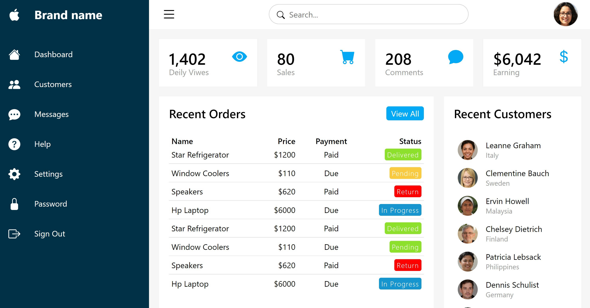
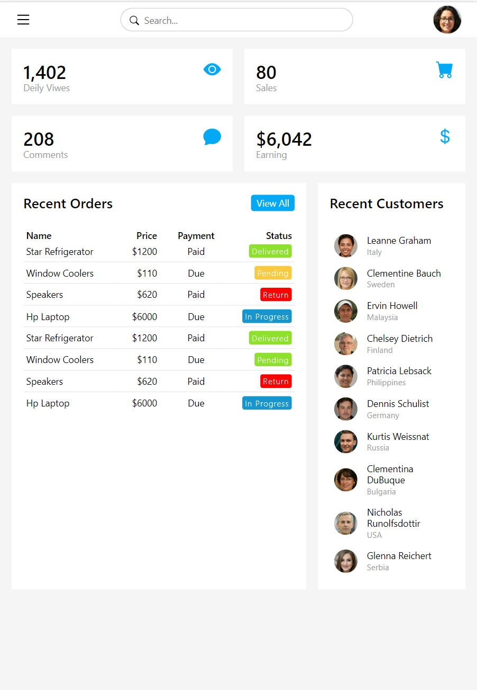
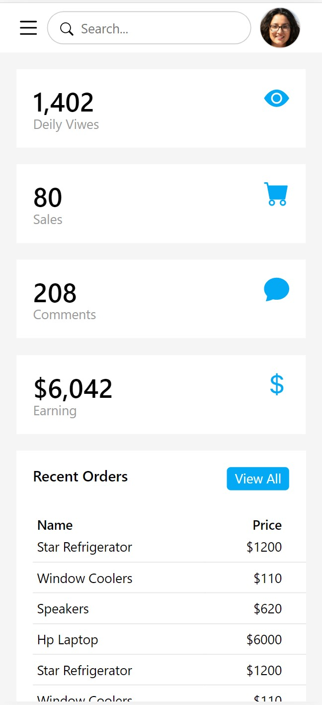

In progress...

# Responsive Admin Dashboard

Dashboard adapted to any device.

## Technology stack

## Result

<!-- [Сlick me](https://annapushka.github.io/responsive-admin-dashboard)  -->

Сurrently working on a Trello clone 

## Author

Anna Pushkareva 
[@AnnaPushka](https://github.com/annapushka)
